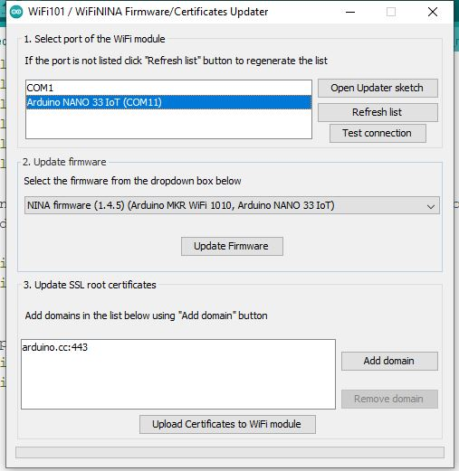
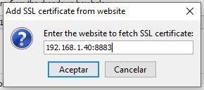

# Presence Detection over TLS
Presence detection using Bluetooth Low Energy with Arduino Nano 33 IoT reporting to a mosquitto server with MQTT hosted on a Raspberry Pi 4 running Telegraf and Grafana.

## Arduino Nano 33 IoT

### Dependencies
* ArduinoBLE.h (by Arduino) 1.2.0
* WiFiNINA.h (by Arduino) 1.8.9
* PubSubClient.h (by Nick O'Leary) 2.8.0

### Approach

The MCU uses an ESP32 module to have access to WiFi and Bluetooth Low Energy.

Since both operate on the 2.42GHz band, the same module re-uses the antenna to provide one or the other **BUT NEVER BOTH AT THE SAME TIME**.

To address this issue, this sketch assumes a 10 second device scanning cycle and afterwards it just reports the device count to the MQTT server.

Feel free to customize your sketch by providing your own `config.h` file with your own parameters.

### Configuring TLS on your Nano 33 IoT

1. Make sure your firmware is updated. To do so make sure you have the latest version of the WiFiNINA library by running the CheckFirmwareVersion sketch under File > Samples > WiFiNINA > Tools > CheckFirmwareVersion. (In your Arduino IDE)

If you are not running the latest version read through, otherwise skip to step 3

2. To update the Firmware version we need to flash our node with the "FirmwareUpdater" sketch. It's under File > Samples > WiFiNINA > Tools > FirmwareUpdater.

Once you've done that, on your Arduino IDE do the following:
* Go to Tools > WiFi 101 / WiFiNINA Firmware Updater
* Select your Node from the available ports
* Select latest version of the NINA firmware (I had to install Arduino nightly build to actually get the latest version of the firmware)
* Click "Update Firmware"
* Done!

3. Head to the section three of the above screenshot and click "Add domain". Fill the popup window with the IP address and port where your broker is serving MQTT so ArduinoIDE can download the root certificate and flash it into the WiFi module.

And finally click "Upload Certificates to WiFi module" and we're done!

### Configuring TLS on your server

Feel free to use the provided bash scripts to generate the CA and broker Certificates alongside their private keys. I've generated mine in my own Raspberry Pi 4

**Important**: In case your server does not have a domain name make sure that when filling out your **broker** form from `openssl` make sure to fill the field `Common Name` with the IPv4 of your server.

Yes, DHCP may break the certificates if you're using DHCP so using a static IP is highly suggested.